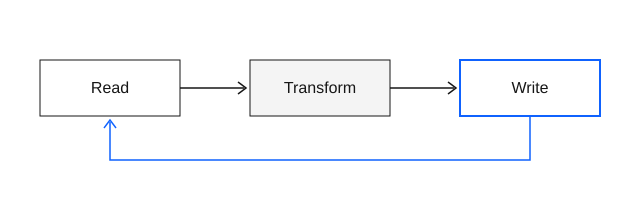

This page is a fixture, not an article. Its job is to show every element at once, so that a change to the design system can be judged in one scroll. Paragraphs should hold roughly sixty to seventy-eight characters per line at the default size, with a [link to the home page](../) and an [external link](https://gohugo.io/) underlined so that color is never the only cue.

Inline elements: *emphasis*, **strong emphasis**, ***both together***, `inline_code()`, a footnote reference,[^short] and a second one with a longer note.[^long] Typographic details matter: "curly quotes", an en dash in 1979–2026, an em dash — like this — and an ellipsis…

## Second-level heading

A second-level heading opens a major section and gets generous space above it. The paragraph that follows should feel attached to its heading, not floating between sections.

### Third-level heading

A long unbroken identifier must not overflow the column on a narrow screen: `org.example.harmonic.labyrinths.reading.ColumnWidthCalculationStrategyFactory`.

#### Fourth-level heading

Fourth-level headings are rare and set in semibold at prose size.

## Lists

An unordered list:

- Structure over decoration.
- Hairlines and surface changes instead of shadows.
  - Nested items keep the same rhythm.
  - And the same marker color.
- Blue is scarce.

An ordered list:

1. State the problem or curiosity.
2. Make the actual argument, with evidence close to each claim.
3. Point to references or further reading.

A definition list:

Essay
: A substantial, self-contained piece with a clear argument.

Note
: A shorter piece that is useful without pretending to be finished.

## Dialogue

A definition list marked as a dialogue:

Achilles
: Have you noticed that this sentence is talking about itself?

Tortoise
: Only when you point it out. Before that, it was minding its own business.
: A second paragraph from the same speaker continues the turn.

Achilles
: Then the page is describing the page. We are in a loop.
{.dialogue}

## Quotation

> A blockquote sits in the reading column with a quiet rule on its leading edge. It may run to several sentences, and should stay readable at the muted ink color.
>
> A second paragraph inside the same quotation.

## Code

A block with a language:

```go
// Fibonacci returns the nth Fibonacci number.
func Fibonacci(n int) int {
	a, b := 0, 1
	for i := 0; i < n; i++ {
		a, b = b, a+b
	}
	return a
}
```

A block with a highlighted line and line numbers:

```python {linenos=true hl_lines=[3]}
def mean(xs: list[float]) -> float:
    """Arithmetic mean; raises on empty input."""
    return sum(xs) / len(xs)  # the line under discussion
```

A diff, where color is backed by the `+` and `-` markers:

```diff
- prose column: 720px
+ prose column: 600px
```

A block without a language, with a line long enough to force horizontal scrolling rather than wrapping:

```
$ hugo --gc --minify --panicOnWarning --baseURL https://example.org/a/very/long/path/that/keeps/going/until/it/must/scroll/
```

## Mathematics

Inline mathematics sits on the line: the identity $e^{i\pi} + 1 = 0$, a sum \(\sum_{k=1}^{n} k = \tfrac{n(n+1)}{2}\), and a probability $P(A \mid B)$. A literal dollar sign is escaped: it costs \$5.

A display equation is centered and scrolls rather than overflowing:

$$
\int_{-\infty}^{\infty} e^{-x^2}\,dx = \sqrt{\pi}
$$

$$
\mathcal{L}(\theta) = -\sum_{i=1}^{N} \Big[ y_i \log \sigma(\theta^\top x_i) + (1 - y_i) \log\big(1 - \sigma(\theta^\top x_i)\big) \Big] + \frac{\lambda}{2} \lVert \theta \rVert_2^2
$$

## Table

| Subset | Characters | Size (KB) |
| :--- | :--- | ---: |
| Latin 1 | Basic Latin and Latin-1 Supplement | 21.0 |
| Latin 2 | Latin Extended-A and common extensions | 9.4 |
| Pi | Arrows, math operators, punctuation | 7.5 |
| Greek | Greek and Coptic | 8.8 |

## Figure



## Rule

Text before a thematic break.

---

Text after a thematic break.

[^short]: A short footnote.
[^long]: A longer footnote that wraps onto more than one line, to check that the hanging indent and line height remain comfortable at the smaller size. The back-link returns to the reference.
